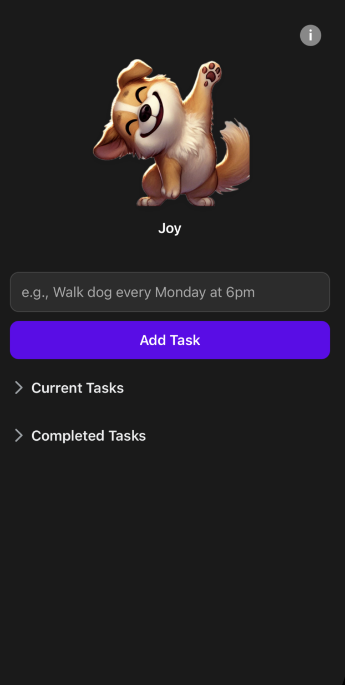

# Todo Reminder with Virtual Companions 🐾 🤖 🚗

A gamified todo list and reminder app with virtual companions that respond to your productivity. Complete tasks to keep your companion happy and unlock achievements! Choose between a pet, robot, or car theme based on your preference.

## 🌟 Features

- **Task Management**: Create, complete, and restore tasks
- **Recurring Tasks**: Set up recurring tasks with natural language (e.g., "Walk dog every Monday at 6pm")
- **Smart Notifications**: Automatic reminders for your scheduled tasks
- **Multiple Companions**: Choose between a pet, robot, or car as your productivity companion
- **Customizable Names**: Give each of your virtual companions a unique name
- **Mood Algorithm**: Your companion's mood changes based on task completion rate, recent activity, and task volume
- **Achievements & Milestones**: Unlock achievements and reach milestones as you complete tasks
- **Progress Tracking**: View your productivity stats and improvement over time
- **Dark/Light Mode**: Automatically adapts to your device theme preference

## 🚀 Getting Started

### Prerequisites

- Node.js (v14 or higher)
- npm or yarn
- Expo CLI (`npm install -g expo-cli`)
- iOS Simulator, Android Emulator, or physical device with Expo Go app

## 📱 How to Use

1. **Choose Your Companion**: Tap the settings icon to switch between pet, robot, and car themes
   - Each companion has its own personality and appearance
   - Name your companion to personalize your experience

2. **Add a Task**: Enter task text in the input field and tap "Add Task"
   - For recurring tasks, use format: "[Task] every [Day] at [Time]"
   - Example: "Walk dog every Monday at 6pm"

3. **Complete a Task**: Tap on any task to mark it as completed
   - Your companion's mood will improve as you complete more tasks
   - Recent completions have a stronger effect on mood

4. **View Task History**: Expand the "Completed Tasks" section to see your completed tasks

5. **Restore Tasks**: Tap on a completed task to move it back to current tasks

6. **Companion Mood Info**: Tap the info button to see details about your companion's current mood and how to improve it

## 🧠 Companion Mood Algorithm

Your companion's mood (whether pet, robot, or car) is calculated using three factors:
- **Completion Rate**: Percentage of total tasks completed
- **Recent Activity**: Tasks completed in the last 48 hours
- **Task Volume**: Total number of tasks in the system

All companions have four mood states:
- 😢 **Sad**: Low productivity (score < 30)
- 😐 **Concerned**: Moderate productivity (score < 60)
- 😊 **Happy**: Good productivity (score < 90)
- 😁 **Joy**: Excellent productivity (score ≥ 90)

## 🛠️ Technologies Used

- **React Native**: UI framework
- **Expo**: Development platform
- **Redux Toolkit**: State management
- **Async Storage**: Local data persistence
- **Expo Notifications**: Push notifications for reminders
- **TypeScript**: Type safety

## 📝 License

This project is not open source. All rights reserved. See the [LICENSE](LICENSE) file for details.

## 🙏 Acknowledgments

- Icons from Expo Vector Icons and SF Symbols